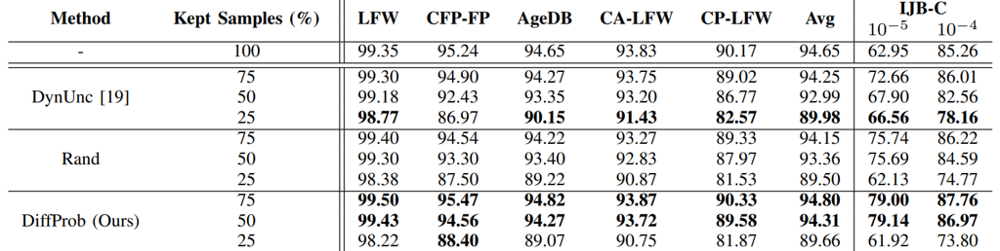
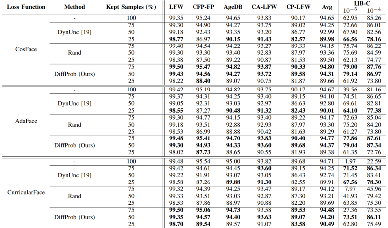
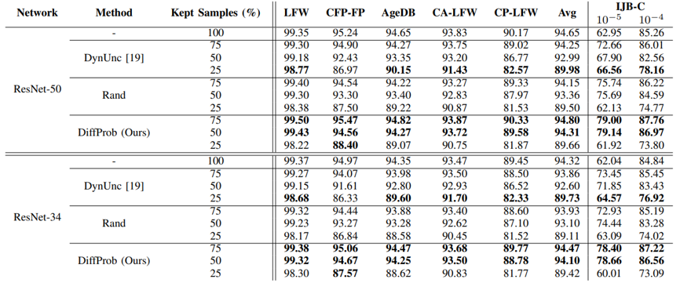
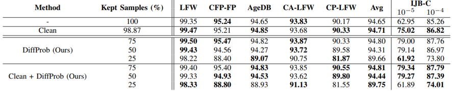

# This is the official repository of the paper: "DiffProb: Data Pruning for Face Recognition" (accepted at FG 2025)

## Abstract
Face recognition models have made substantial progress due to advances in deep learning and the availability of large-scale datasets. However, reliance on massive annotated datasets introduces challenges related to training computational cost and data storage, as well as potential privacy concerns regarding managing large face datasets. This paper presents DiffProb, the first data pruning approach for the application of face recognition. DiffProb assesses the prediction probabilities of training samples within each identity and prunes the ones with identical or close prediction probability values, as they are likely reinforcing the same decision boundaries, and thus contribute minimally with new information. We further enhance this process with an auxiliary cleaning mechanism to eliminate mislabeled and label-flipped samples, boosting data quality with minimal loss. Extensive experiments on CASIA-WebFace with different pruning ratios and multiple benchmarks, including LFW, CFP-FP, and IJB-C, demonstrate that DiffProb can prune up to 50% of the dataset while maintaining or even, in some settings, improving the verification accuracies. Additionally, we demonstrate DiffProb’s robustness across different architectures and loss functions. Our method significantly reduces training cost and data volume, enabling efficient face recognition training and reducing the reliance on massive datasets and their demanding management.

## Pruned Dataset Files

You can request access to the files containing the indexes of the kept samples for each pruning strategy applied in this work [here](https://drive.google.com/drive/folders/1Dh0tKCR_n0Nh3B4amMwy_bBNvkpwwFpK?usp=sharing).

## Results

### Impact of Face Data Pruning

### Generalizability Across Different Losses

### Generalizability Across Different Network Architectures

### Impact of Data Cleaning

## Download CASIA-WebFace

You can download the CASIA-WebFace dataset [here](https://github.com/deepinsight/insightface/tree/master/recognition/_datasets_).

## How to Run?

1. Run `train_everything.py` to train the original model (set `config.is_original_train=True` in `config/config.py`), whose predictions will be used to perform the pruning (in the paper, ResNet-50 + CosFace loss). This script will automatically generate the files necessary to perform **DynUnc** pruning

### DynUnc
2. Run `coreset_dynunc.py` to generate the kept sample list for the selected pruning percentage
3. Run `label_mapping.py` if you want to confirm that the number of ids has not been altered (this step is **not mandatory**)
4. Run `train_everything.py` under the desired settings

### Rand
Note: keep in mind that **Rand** can be applied before performing step 1
2. Run `coreset_rand.py` to generate the kept sample list for the selected pruning percentage
3. Run `label_mapping.py` if you want to confirm that the number of ids has not been altered (this step is **not mandatory**)
4. Run `train_everything.py` under the desired settings

### DiffProb (ours)
2. Run `eval_trainset.py` to generate the ground truth prediction of the pre-trained FR model for each sample

**Without Cleaning**

3. Run `eval_simprobs.py` to generate the kept sample list for the selected pruning percentage
4. Run `label_mapping.py` if you want to confirm that the number of ids has not been altered (this step is **not mandatory**)
5. Run `train_everything.py` under the desired settings

**With Cleaning**

3. Run `clean_trainset.py` to apply our auxiliary cleaning mechanism and generate the kept sample list for the selected pruning percentage
4. Run `generate_label_dict.py` to generate a dictionary associating each identity (class label) with the indexes of its samples
5. Run `label_mapping.py` if you want to confirm that the new number of ids **and** to generate a label map, as some identities might be eliminated (this step is **mandatory**)
6. Run `train_everything.py` under the desired settings

### IJB-C Evaluation
Run `eval_ijbc.py` to perform IJB-C evaluation

## Citation 

If you use any of the code, pruned datasets or models provided in this repository, please cite the following paper:

<pre>@misc{caldeira2025diffprobdatapruningface,
      title={DiffProb: Data Pruning for Face Recognition}, 
      author={Eduarda Caldeira and Jan Niklas Kolf and Naser Damer and Fadi Boutros},
      year={2025},
      eprint={2505.15272},
      archivePrefix={arXiv},
      primaryClass={cs.CV},
      url={https://arxiv.org/abs/2505.15272}, 
} </pre>

## License

<pre>This project is licensed under the terms of the Attribution-NonCommercial 4.0 International (CC BY-NC 4.0) license. 
Copyright (c) 2025 Fraunhofer Institute for Computer Graphics Research IGD Darmstadt </pre>
